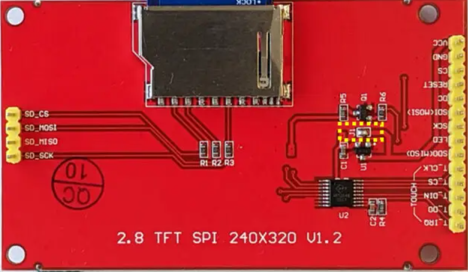
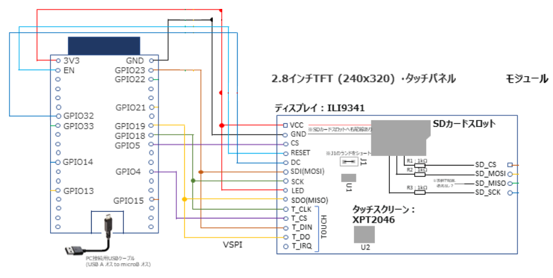
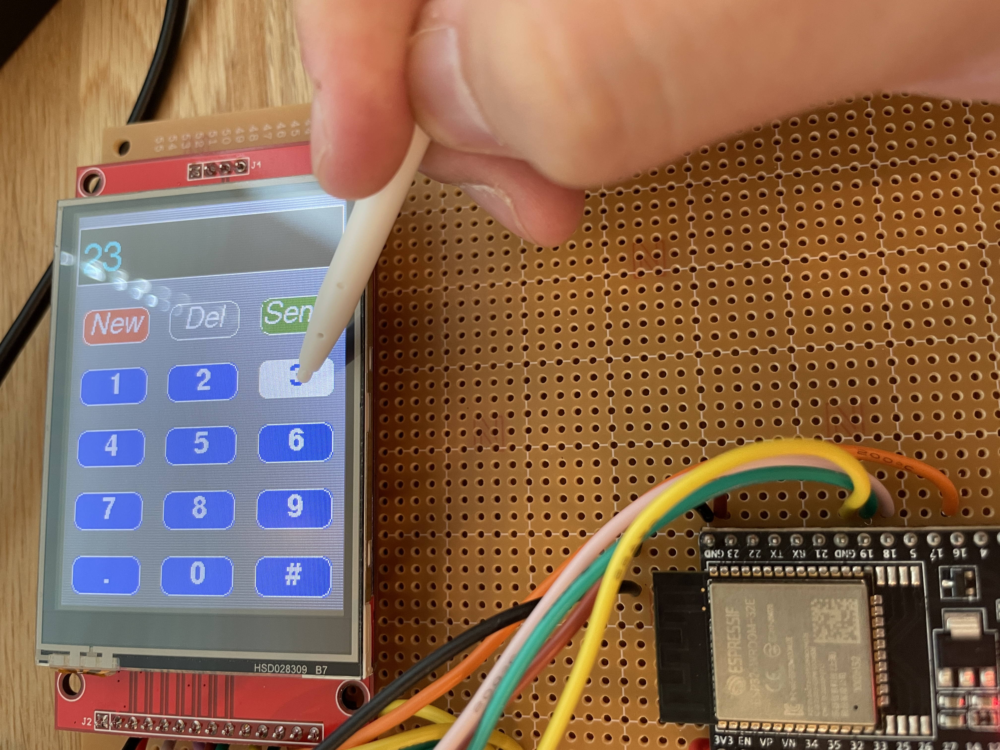
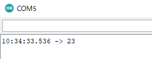

# esp32-ili9341-test

ili9341をesp32に接続し、画面表示するまでを確認する。
基本的には[参考](https://yokahiyori.com/esp32-devkitc_ili9341-lcd_tft_espi/)にさせていただいたページ通りだが、
実際に手作業で行った様子と元ページが削除されてしまうリスクを考慮し
メモ程度に残しておく

## 準備

[参考ページ](https://yokahiyori.com/esp32-devkitc_ili9341-lcd_tft_espi/)や[秋月の商品ページ](https://akizukidenshi.com/catalog/g/gM-16265/)にも書かれているようにili9341を3.3Vで動作させるためにはJ1をはんだ付けするひつようがあるそうなので、実施する



## 結線

### 回路図

[参考ページ](https://yokahiyori.com/esp32-devkitc_ili9341-lcd_tft_espi/)をベースにさせてい頂き、SDカードを排除するとこのような結線回路図になる



### 実際に結線した図

esp32とili9341を実際に結線した様子を以下に示す。


## コード

1. [TFT_eSPIのgithubページ](https://github.com/Bodmer/TFT_eSPI)からzipをダウンロード
1. arduino IDEより「「スケッチ > ライブラリをインクルード > ZIP形式の ライブラリを インストール」でダウンロードしたzipを指定
1. ライブラリ内の「User_Setup.h」を以下のように修正する
    * フォルダパスは`C:\Users\(UserName)\OneDrive\ドキュメント\Arduino\libraries\TFT_eSPI-master`など環境によって異なる
    * User_Setup.h抜粋
```C

// For ESP32 Dev board (only tested with ILI9341 display)
// The hardware SPI can be mapped to any pins

#define TFT_MISO 19
#define TFT_MOSI 23
#define TFT_SCLK 18
#define TFT_CS   5  // Chip select control pin
#define TFT_DC    32  // Data Command control pin
//#define TFT_RST   4  // Reset pin (could connect to RST pin)
#define TFT_RST  -1  // Set TFT_RST to -1 if display RESET is connected to ESP32 board RST
```
1. arduino IDEより「スケッチ例 > TFT_eSPI > 320 x 240 > Keypad_240x320」を選択
1. サンプルコードを以下のように修正
```C
void setup() {
  // Use serial port
  Serial.begin(115200);
```
## 実行したようす

1. 最初にキャリブレーションが実行されるため、プラスチックペンなどで４つ端をタップする
    * キャリブレーションは基本的に2回目以降は、１回目のキャリブレーションを読みだすため、調整は実施されない
    * もし再度実施したい場合は、ファイルの先頭の値をfalse→trueにして起動、実行したのち、元に戻す
    ```C
    // Set REPEAT_CAL to true instead of false to run calibration
    // again, otherwise it will only be done once.
    // Repeat calibration if you change the screen rotation.
    #define REPEAT_CAL true // default false
    ```
1. 未入力画面が表示される


1. 数字を入力すると表示される



1. Sendボタンを押すとシリアルに表示される


1. シリアルモニターで確認した結果



以上で、画面表示、タッチパネル入力、ホストとのシリアル通信が確認できる


